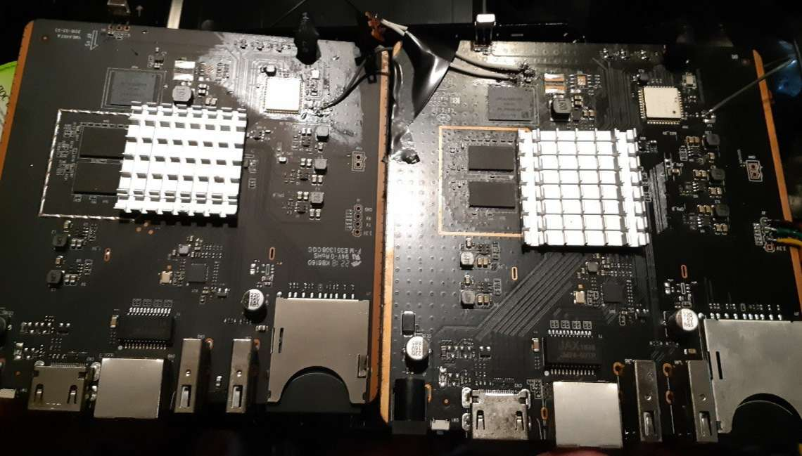

## PROTOTYPE-DEMO-HOMEAISYSTEM

Voice-based Home Assistant with Offline Speech Synthesis and Home Automation Integration (2022/2023)

This project aims to replicate the functionality of Yandex's Alice smart speakers, providing near real-time offline decoding and encoding of Russian speech while offering integration with MQTT and Domoticz for smart home peripheral control. Decision-making and dialogue support are handled through ChatGPT3Turbo/4.

### Features

• Offline decoding and encoding of Russian speech

• Home automation control integration via MQTT and Domoticz

• ChatGPT-powered decision-making and dialogue support

• Support for both male and female voices with a focus on high-quality female voice

• Compatibility with older platforms (Amlogic S912 or Raspberry Pi 4) for broader accessibility

### Highlights

• Developed and deployed in 2022 within a 2-week timeframe

• Written using Rust, Python and C++, and open source models.

### Hardware Requirements

• Amlogic A311D2 or equivalent (2021, 12 nm, 4x ARM Cortex-A73 @ 2.3 GHz, 4x ARM Cortex-A53 @ 2.0 GHz), 4Gb DDR4, 1Gbit Eth, 2.4Ghz/5Ghz

### Supported Platforms

• Amlogic A311D2/A311D

• Amlogic S922X

• <i>Satisfactory ability to work on older platforms: based on Amlogic S912 (ARM Cortex-A53 x8 1.5Ghz(Unlocked)), 2GB DDR3, 1Gbit Eth, 2.4/5Ghz Wifi, CPU Mode; or Raspberry PI 4.</i>

### Demonstration

1. <a href="https://disk.yandex.ru/i/GBPuGDhcUAQvfA">[1]: Short info</a>

2. <a href="https://disk.yandex.ru/i/d1bfZE99dS-Bcg">[2]: Control + Mqtt</a>

